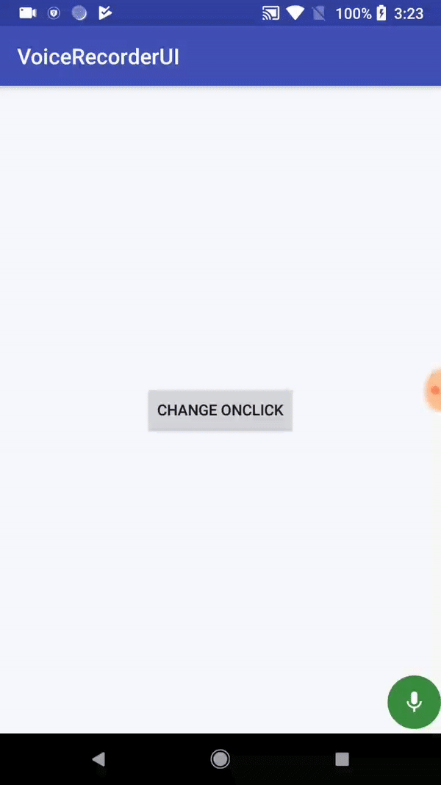

# VoiceRecorderUI
Sample application to show slide to cancel voice recorder UI with animation


## Sample
<p align="lefy">
  
</p>

## Code
To animate the view outside the parent view boundary set below propery for the each parent of the view
```
viewGroup.clipChildren = false
viewGroup.clipToPadding = false
```
or in xml in each parent
```
android:clipChildren="false"
android:clipToPadding="false"
```
set all parent view value in loop
```
fun setAllParentsClip(view: View, enabled: Boolean) {
        var view = view
        while (view.parent != null && view.parent is ViewGroup) {
            val viewGroup = view.parent as ViewGroup
            viewGroup.clipChildren = enabled
            viewGroup.clipToPadding = enabled
            view = viewGroup
        }
    }
```    

#### Credit
[RecordView](https://github.com/3llomi/RecordView) 
